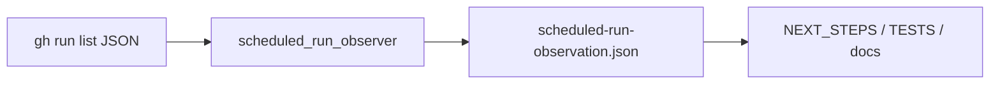

# Design — B Scheduled Run Observer

## Overview

Add `scripts/scheduled_run_observer.py`, a small fail-closed observer for GitHub Actions run-list evidence. It complements the existing schedule report/proof builder by answering a different question: "Has an autonomous cron `event=schedule` run actually succeeded?"

## Architecture

## Test Coverage Declaration

- Unit: manual-only pending and successful schedule promotion tests.
- Mutation: `b-scheduled-observer-manual-pending` changes pending classification to proven and must be killed.
- Smoke: CLI consumes live `gh run list` JSON and emits a pending artifact when no schedule run exists.

## Repo-side Closure vs External Execution Boundary

Repo-side closure is the observer, tests, mutation, and current observation artifact/report. External execution remains the future GitHub cron run. The observer must not synthesize or simulate that external event.

## Contracts

No API contract changes. The observation artifact shape is a local evidence contract:

- `artifact_kind=scheduled_run_observation`
- `claim_boundary=manual_dispatch_is_not_cron`
- `status=pending|proven`
- `evidence_tier=external_pending|live`
- `latest_schedule_success`
- `latest_schedule_attempt`
- `latest_failed_schedule`
- `latest_manual_success`

## Components and Interfaces

- `build_scheduled_run_observation(runs, workflow=...)`
- `write_scheduled_run_observation(observation, out_dir)`
- CLI:
  - `--runs-json` deterministic input
  - live `gh run list` fallback
  - exit `0` only when schedule proof is proven; exit `2` when still pending

## FMEA

| Risk ID | Failure Mode | Effect | Cause | Current Control | Severity | Occurrence | Detection Difficulty | Planned Response | Task Trace |
|---|---|---|---|---|---:|---:|---:|---|---|
| FMEA-BSRO-1 | Manual run promoted to cron proof | Overstated production readiness | Event semantics lost | Existing docs warnings | 8 | 4 | 3 | Explicit claim boundary and manual-only pending test | T1 |
| FMEA-BSRO-2 | Failed schedule run hidden by later data | Missed degraded ops signal | Only checking success | None | 6 | 3 | 4 | Preserve latest failed schedule separately | T1 |
| FMEA-BSRO-3 | Live GH dependency makes tests flaky | False red/green | Tests call GitHub | None | 5 | 3 | 5 | Support `--runs-json` deterministic input | T2 |

## Risk Response and Mitigation Plan

- Prevent: classify only completed successful `event=schedule` as `proven`.
- Detect: mutation spot check for manual-only false promotion.
- Contain: CLI writes the pending artifact even when exiting non-zero.

## EDD

- `uv run pytest -q tests/test_daily_snapshot.py -k scheduled_run_observer`
- `uv run python scripts/run_mutation_spot_checks.py --only b-scheduled-observer-manual-pending`
- live smoke with `gh run list --workflow daily-snapshot.yml --json ...` piped through `--runs-json`

## Traceability

- REQ-BSRO-001 -> observer classification tests.
- REQ-BSRO-002 -> CLI smoke.
- REQ-BSRO-003 -> mutation spot check.
