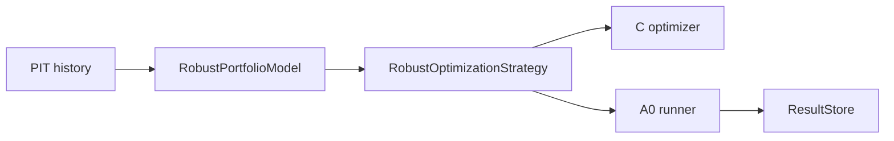

# Design — D Robust Portfolio Optimization Model

References: [requirements.md](./requirements.md), [d-return-risk-forecast-model review](../d-return-risk-forecast-model/review.md), [c-portfolio-core design](../c-portfolio-core/design.md).

## Overview

The robust optimizer model estimates each asset's annualized return, downside semideviation, and volatility from PIT price history. It computes `adjusted_return = mean_return - downside_penalty * downside_semideviation` and feeds the adjusted returns plus diagonal covariance into the existing C optimizer.

## Architecture

## Test Coverage Declaration

- Unit: estimate status, downside penalty monotonicity, fallback metadata.
- Property-Based: positive price paths produce finite long-only weights summing to one.
- Integration: A0 runner logs robust strategy and static baseline.
- Smoke: benchmark helper returns run IDs, leaderboard, and `no_alpha_claim`.
- Mutation: claim-boundary mutation must be killed.
- Coverage: line coverage for `quantlab.models.robust_optimization` must exceed 80%.

## Repo-side Closure vs External Execution Boundary

Repo-side closure includes deterministic model and tests only. Tier3 MLOps remains a later reassessment.

## Contracts

No new generated contract. The strategy conforms to A0 `Strategy` and uses C optimizer.

## Components and Interfaces

- `RobustAssetEstimate`: per-symbol adjusted estimate.
- `RobustPortfolioModel`: PIT estimator.
- `RobustOptimizationStrategy`: A0 strategy adapter.
- `run_robust_optimization_benchmark`: OOS-net benchmark helper.

## Failure Mode and Effects Analysis

| Risk ID | Failure Mode | Effect | Cause | Current Control | Sev | Occ | Det | Planned Response | Task Trace |
|---|---|---|---|---|---:|---:|---:|---|---|
| FMEA-D3-01 | Model uses future returns | Lookahead | Bad history query | A0 PIT provider only | 10 | 3 | 3 | tests call `history(asof)` and compare deterministic outputs | D3-1 |
| FMEA-D3-02 | Downside penalty accidentally rewards downside | Wrong model semantics | Sign bug | monotonic unit test | 8 | 3 | 2 | penalty test and mutation candidate | D3-1 |
| FMEA-D3-03 | Model is presented as alpha-ready | Overclaim | Metadata drift | no-alpha metadata | 8 | 3 | 2 | claim-boundary mutation | D3-4 |

## Risk Response and Mitigation Plan

- Prevent: deterministic PIT-only estimator.
- Detect: unit, PBT, integration, smoke, mutation, coverage.
- Contain: equal-weight fallback and explicit `no_alpha_claim`.

## Error Handling

Invalid estimates degrade and trigger equal-weight fallback. Benchmark rejects too-short date ranges.

## Evaluation Standards

- Targeted tests pass.
- Coverage >=80%.
- Mutation killed.
- Full project gates remain green.

## Traceability References

- `REQ-D3-ROBUST-001` -> `RobustPortfolioModel.estimate`
- `REQ-D3-ALLOC-001` -> `RobustOptimizationStrategy.generate_signal`
- `REQ-D3-BENCH-001` -> `run_robust_optimization_benchmark`
