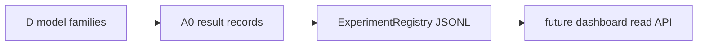

# Design — E MLOps Tier3 Lite

References: [requirements.md](./requirements.md), [../e-mlops-tier3-readiness.md](../e-mlops-tier3-readiness.md).

## Overview

Add `quantlab.mlops.ExperimentRegistry`, a lightweight JSONL registry for deterministic research experiment entries. The registry is intentionally local and file-backed; it is a lineage/config catalog, not a serving runtime.

## Architecture

## Test Coverage Declaration

- Unit: register/get/list/reject invalid claim boundary.
- PBT: config roundtrip preserves generated values.
- Mutation: default claim-boundary mutation must be killed.
- Integration/smoke: file-backed registry survives reopening.
- Line coverage: stdlib trace fallback acceptable if `pytest-cov` hits known NumPy instrumentation issue.

## Repo-side Closure vs External Execution Boundary

Repo-side closure is complete when registry code, tests, mutation, coverage, and governance artifacts pass. No external runtime is required.

## Contracts

Local contract is the `ExperimentEntry` dataclass in `quantlab/mlops/experiment_registry.py`. It is intentionally not generated because this is an internal Python-only registry first slice.

## Components

- `ExperimentEntry`: immutable registry record with `status=research_only` and `readiness=registry_only`.
- `ExperimentRegistry`: append-backed JSONL storage with deterministic IDs and dedupe.

## FMEA

| Risk ID | Failure Mode | Effect | Control | Response | Task Trace |
|---|---|---|---|---|---|
| FMEA-E-LITE-01 | Registry implies production MLOps | Overclaim | explicit status/readiness fields | Detect through tests/review wording | E-1/E-4 |
| FMEA-E-LITE-02 | Alpha claim enters registry | Misleading leaderboard/demo | validation + mutation | Prevent by rejecting non-`no_alpha_claim` | E-1/E-3 |
| FMEA-E-LITE-03 | Duplicate configs fragment lineage | Unreproducible comparisons | deterministic ID | Detect through dedupe test | E-1 |

## EDD

- `uv run pytest -q tests/quantlab/test_e_1_experiment_registry.py`
- trace coverage for `quantlab.mlops.experiment_registry` >=80%.
- `uv run python scripts/run_mutation_spot_checks.py --only e-registry-claim-boundary`

## Traceability References

- `REQ-E-LITE-REG-001` -> `ExperimentRegistry.register`, tests.
- `REQ-E-LITE-READ-001` -> `ExperimentEntry.status/readiness`, tests, review.
