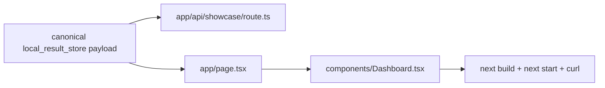

# Design — F Next.js Showcase Dashboard

References: [requirements.md](./requirements.md), [f-showcase-read-api-dashboard review](../f-showcase-read-api-dashboard/review.md), [SPECS.md](../SPECS.md).

## Overview

Add a contained `frontend/` Next.js app. The first runtime consumed a checked-in canonical fixture derived from the Python showcase payload contract. Current dashboard payload authority is superseded by CR-FPS-006: a generated canonical local result-store payload (`local_result_store`) that still proves the real Next.js rendering and route shape without introducing production deployment claims.

## Architecture

## Test Coverage Declaration

- Unit: dashboard component renders required sections and warnings.
- Property-Based: leaderboard ordering validator rejects unsorted rows.
- Integration: `/api/showcase` route returns the canonical payload.
- Smoke: `next build`; `next start` + HTTP GET `/`.
- Mutation: dashboard claim-boundary mutation must be killed by frontend tests.
- Coverage: Vitest coverage for `components` and `lib` must exceed 80% line coverage.

## Repo-side Closure vs External Execution Boundary

Repo-side closure proves local Next.js runtime. Public hosting, screenshots, and production deployment remain future work.

## Contracts

`frontend/lib/showcase-contract.ts` defines TypeScript interfaces and validation helpers for dashboard data. It is the frontend-local contract mirror for F, derived from the Python payload shape.

## Components and Interfaces

- `Dashboard`: server-renderable React component.
- `getShowcaseDashboard`: reads the generated canonical local result-store payload.
- `assertDashboardPayload`: runtime validator used by tests and API route.
- `/api/showcase`: Next route handler returning validated JSON.

## Failure Mode and Effects Analysis

| Risk ID | Failure Mode | Effect | Cause | Current Control | Sev | Occ | Det | Planned Response | Task Trace |
|---|---|---|---|---|---:|---:|---:|---|---|
| FMEA-FNX-01 | Component tests pass but app cannot run | False demo readiness | No runtime smoke | Build/start smoke required | 9 | 4 | 2 | `next build` + HTTP smoke | FNX-4 |
| FMEA-FNX-02 | Dashboard changes claim boundary | Overclaim | UI copy drift | Contract + mutation test | 9 | 3 | 2 | Preserve `no_alpha_claim` assertions | FNX-2/FNX-4 |
| FMEA-FNX-03 | Leaderboard order changes in frontend | Misleading results | Client-side sort bug | PBT order validation | 8 | 3 | 3 | Validator and tests | FNX-1 |

## Risk Response and Mitigation Plan

- Prevent: typed contract and runtime validation.
- Detect: Vitest unit/PBT/integration tests and mutation check.
- Contain: review states local runtime proof only, no hosted deployment claim.

## Error Handling

Malformed local result-store dashboard payloads throw during validation, causing tests/build-time usage to fail closed.

## Evaluation Standards

- `npm test -- --run` passes.
- `npm run coverage` reports >=80% line coverage for frontend source.
- Mutation check for claim boundary is killed.
- `npm run build` passes.
- Local `next start` HTTP smoke returns the dashboard page.

## Traceability References

- `REQ-FNX-DASH-001` -> `components/Dashboard.tsx`, `app/page.tsx`
- `REQ-FNX-API-001` -> `app/api/showcase/route.ts`, `lib/showcase-contract.ts`
- `REQ-FNX-SMOKE-001` -> smoke report
