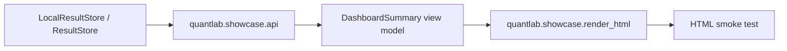

# Design — F Showcase Read API Dashboard

References: [requirements.md](./requirements.md), [SPECS.md](../SPECS.md), [NEXT_STEPS.md](../NEXT_STEPS.md), [a0 design](../a0-backtest-foundation/design.md), [d-first-regime-model review](../d-first-regime-model/review.md).

## Overview

This first F slice adds a repo-local showcase read surface around existing QuantLab result records. It deliberately avoids a full Next.js scaffold until the backend payload contract is stable and smoke-tested.

## Architecture

## Test Coverage Declaration

- Unit: leaderboard/read-detail serialization and conservative defaults.
- Property-Based: dashboard summaries preserve sorted leaderboard order and never mutate source run records.
- Integration: `LocalResultStore` populated with real QuantLab-shaped records flows through API to dashboard summary.
- Smoke: deterministic HTML render contains the expected sections and warning labels.
- Mutation: repo-local mutation runner extended or supplemented to kill a showcase claim-boundary/default mutation.
- Coverage: `pytest --cov=quantlab.showcase --cov-report=term-missing` must exceed 80% line coverage.

## Repo-side Closure vs External Execution Boundary

- Repo-side closure is complete when the Python read API, dashboard view model, renderer, tests, mutation spot check, and governance artifacts pass.
- External execution for a real Next.js runtime and browser visual proof is pending future F continuation.
- Live-demo readiness is capped at `CONDITIONAL` / `hybrid` for this slice.

## Contracts

No generated contract is introduced in this slice. The local contract is a typed Python response shape in `quantlab/showcase/api.py`, derived from `ResultStore.leaderboard()` and `ResultStore.get()`.

## Components and Interfaces

- `quantlab.showcase.api.ShowcaseReadAPI`: read-only facade over any A0-compatible result store.
- `quantlab.showcase.api.build_dashboard_summary`: converts run + leaderboard records into stable dashboard data.
- `quantlab.showcase.html.render_dashboard_html`: deterministic HTML smoke artifact, not a full frontend framework.

## Failure Mode and Effects Analysis

| Risk ID | Failure Mode | Effect | Cause | Current Control | Sev | Occ | Det | Planned Response | Task Trace |
|---|---|---|---|---|---:|---:|---:|---|---|
| FMEA-F-01 | HTML smoke is mistaken for full Next.js demo readiness | Overclaim | First slice lacks frontend runtime | Explicit boundary in requirements | 8 | 4 | 3 | Review labels readiness `CONDITIONAL` | F-4/F-5 |
| FMEA-F-02 | Dashboard hides missing regime/claim metadata | False green | Optional metadata absent | Conservative defaults | 7 | 5 | 3 | Negative tests for `unknown` and `no_alpha_claim` | F-2 |
| FMEA-F-03 | Leaderboard order drifts from A0 OOS-net rule | Misleading showcase | Re-sorting or wrong metric | Use store leaderboard order | 8 | 3 | 3 | PBT sorted-order invariant | F-2 |

## Risk Response and Mitigation Plan

- Prevent: API consumes `ResultStore` output rather than querying SQLite directly.
- Detect: PBT and integration tests cover order preservation and missing metadata warnings.
- Contain: Review and dashboard payload carry `claim_boundary = no_alpha_claim` and live-demo readiness downgrade.

## Error Handling

Missing run IDs raise `KeyError`. Missing optional metadata returns conservative values in the dashboard payload.

## Evaluation Standards

- F tests pass in `uv run pytest -q tests/quantlab/test_f_1_showcase_api.py`.
- Showcase line coverage is at least 80%.
- Integration and smoke tests run without network or external services.
- Mutation spot check kills the configured showcase mutation.

## Traceability References

- `REQ-F-SHOWCASE-001` -> `ShowcaseReadAPI.leaderboard`, `ShowcaseReadAPI.run_detail`
- `REQ-F-SHOWCASE-002` -> `build_dashboard_summary`
- `REQ-F-SHOWCASE-003` -> `render_dashboard_html`
