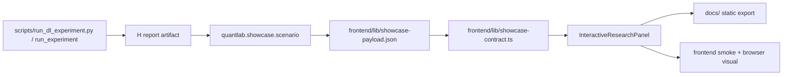

# Design — H Interactive Research UI (slice H-3)

> SDD Phase 2. Requirements: [requirements.md](./requirements.md).
> Contract: [contract/interactive-research.schema.json](./contract/interactive-research.schema.json).

## 1. Overview

Slice H-3 adds an **Interactive Research UI** bounded context to the existing
showcase dashboard. The first implementation is a static-replay/local-execution
bridge: the public export renders a committed deterministic Epic H artifact and
lets users adjust parameters, but it fails closed when the selected parameter set
has no matching deterministic artifact. Live reruns stay repo-local and future
API-backed execution must call `scripts/run_dl_experiment.py` or a thin wrapper
around `run_experiment`, never a TypeScript reimplementation.

Domain language:

- **ResearchParameters**: backend, hidden units, lookback, epochs, seed, rebalance
  cadence, and symbols.
- **InteractiveResearchPayload**: the contract block embedded in
  `ShowcaseDashboard`, carrying parameters, ranges, resolved backend, data lineage,
  artifact id/checksum/path, rows, and warnings.
- **ResearchReplaySelection**: the UI state for a submitted parameter set:
  `computed` only when it matches the committed artifact checksum, otherwise
  `fail_closed`.
- **ArtifactLineage**: deterministic `experimentId`, report checksum, artifact path,
  and visualization path traceable to the H report/registry lineage model.

## 2. Architecture

- `quantlab.showcase.scenario` owns canonical replay generation. It maps an H-like
  deterministic report into `interactiveResearch` without changing H-1/H-2 report
  schema, A0 engine/data imports, or E registry semantics.
- `frontend/lib/showcase-contract.ts` validates the new dashboard block against the
  spec-local contract semantics: `no_alpha_claim`, OOS-net metric authority, visible
  baseline, approximate-data warning, sorted rows, and checksum shape.
- `frontend/lib/interactive-research.ts` holds pure parameter validation and replay
  selection logic. It is the TDD target for invalid ranges, unsupported replay
  combinations, checksum mismatch, and absent torch fallback messaging.
- `frontend/components/InteractiveResearchPanel.tsx` is a client component. It uses
  existing quiet dashboard styling, stable control dimensions, and no marketing
  language. It never starts a live experiment in the public static export.
- Static public proof remains governed by `frontend/lib/public-demo.ts`: a new data
  hash requires a fresh live probe before `hostingEvidence.status` can be `proven`.

## 3. Test Coverage Declaration

- **Unit:** TypeScript contract validation, parameter validation, replay selection,
  checksum/claim-boundary/data-lineage negative cases, and Python scenario payload
  generation.
- **Property-Based:** supported parameter ranges accept finite values; invalid
  integers/unknown backends/rebalance values fail closed; leaderboard rows remain
  OOS-net sorted with baseline visible.
- **Integration:** generated canonical showcase payload includes H-3 lineage and is
  accepted by the Next.js API route; the H CLI wrapper path remains the future live
  execution authority and insufficient-data tests continue to fail closed.
- **Smoke/E2E:** `npm run smoke` verifies the rendered HTML and API payload include the
  interactive section, no-alpha boundary, approximate-data warning, and artifact id.
  `npm run e2e:interactive` starts the built Next.js app, drives Chromium through the
  H-3 parameter workflow, changes the seed, and verifies the browser UI fails closed.
- **Visual:** `npm run visual && npm run visual:browser` covers the loaded computed
  state. `npm run e2e:interactive` adds a browser-level fail-closed VRT screenshot
  baseline for the unsupported-parameter state.
- **Mutation:** frontend mutation checks must kill at least the no-alpha/approximate
  warning gate for the new section; Python mutation remains unchanged unless scenario
  mutation hooks are added.
- **Coverage:** frontend coverage remains above repo thresholds; touched Python files
  stay under the full pytest and mypy gates.

## 4. Repo-side Closure vs External Execution Boundary

Repo-side closure includes requirements/design/tasks, schema contract, deterministic
payload generation, frontend UI/API/static export, tests, visual baseline, smoke,
governance registries, and review. External execution includes GitHub Pages deployment
and live public probe refresh; those can re-prove public parity after merge but cannot
be used as the only proof of H-3 UI correctness.

## 5. Components and Interfaces

- `.agents/specs/h-interactive-research-ui/contract/interactive-research.schema.json`:
  spec authority for the embedded dashboard block.
- `quantlab.showcase.scenario`: add `_interactive_research_section(...)` and include it
  in `_frontend_payload(...)`.
- `frontend/lib/showcase-contract.ts`: add `InteractiveResearchPayload` types and
  validation.
- `frontend/lib/interactive-research.ts`: pure validation/selection helpers.
- `frontend/components/InteractiveResearchPanel.tsx`: controls and computed/fail-closed
  render states.
- `frontend/components/Dashboard.tsx`: render `data-section="interactive-research"`.
- `frontend/lib/public-demo.ts` and smoke scripts: include the new section in static
  manifest/visual/smoke contracts.

## 6. Failure Mode and Effects Analysis

| Risk ID | Failure Mode | Effect | Cause | Current Control | Sev | Occ | Det | Planned Response | Task Trace |
|---|---|---|---|---|---:|---:|---:|---|---|
| FMEA-H3-01 | UI implies public live execution | False live/production claim | Static export hides replay boundary | `mode="static_replay"` + public manifest sections | 9 | 3 | 2 | Render mode and fail closed for unsupported params | H3-2/H3-5 |
| FMEA-H3-02 | Parameter changes recalculate evidence in TS | Divergence from H CLI lineage | Duplicate logic in frontend | Design forbids TS calculation path | 8 | 3 | 3 | Pure UI only selects deterministic artifacts; future live path wraps H CLI | H3-2 |
| FMEA-H3-03 | Alpha or strategy recommendation wording leaks | Overclaim | New UI copy/contract drift | Contract literals + mutation | 9 | 2 | 2 | Negative tests reject non-`no_alpha_claim` payload | H3-1/H3-6 |
| FMEA-H3-04 | Approximate CR-B21 data appears strict PIT | Misleading data authority | Warning omitted or flag false | Contract requires approximate + strict-PIT-excluded flags | 9 | 3 | 2 | Tests and smoke assert warning text | H3-1/H3-4 |
| FMEA-H3-05 | Stale artifact checksum renders as computed | False-green visual evidence | Payload/hash mismatch | Artifact checksum and selection validation | 8 | 3 | 2 | Fail closed on checksum mismatch | H3-1/H3-2 |
| FMEA-H3-06 | Torch absent is shown as PyTorch run | Backend evidence overclaim | Requested/resolved backend conflated | Backend fields carry requested/resolved/fallback | 7 | 3 | 3 | UI renders fallback reason and tests absent-torch state | H3-2/H3-3 |
| FMEA-H3-07 | Visual baselines remain stale | Review/docs false green | HTML changed without VRT refresh | Browser visual smoke compares PNG/docs | 6 | 4 | 2 | Regenerate visual/export docs before review | H3-5/H3-7 |

## 7. Risk Response and Mitigation Plan

- Prevent: schema literals, pure selection helpers, static-replay label, and no new
  framework imports outside the existing H backend boundary.
- Detect: unit/PBT/negative contract tests, smoke HTML/API checks, public manifest hash,
  and browser visual diff.
- Contain: unsupported parameter sets, stale checksum, insufficient data, and absent
  backend evidence render as `fail_closed` without charts or leaderboard claims.

## 8. Error Handling

Invalid parameters return validation errors and do not select an artifact. Unknown
backend or rebalance values fail closed. Missing or mismatched checksum returns a
fail-closed replay state. Missing framework evidence is represented by
`resolvedBackend.resolved="reference"` and a fallback reason. Public hosting remains
non-proven until `refresh_public_hosting_proof.py --live` observes matching deployed
hashes.

## 9. EDD

- `uv run pytest -q tests/quantlab/test_h3_interactive_showcase.py`
- `uv run pytest -q tests/quantlab/test_governance_guards.py`
- `uv run pytest -q`
- `uv run mypy quantlab/ --ignore-missing-imports`
- `uv run lint-imports`
- `git diff --check`
- `cd frontend && npm test -- --run`
- `cd frontend && npm run coverage`
- `cd frontend && npm run visual && npm run visual:browser`
- `cd frontend && npm run e2e:interactive`
- `cd frontend && npm run build && npm run smoke`
- `cd frontend && npm run mutation`

## 10. Traceability References

- `REQ-H3-PARAM-001` -> `frontend/lib/interactive-research.ts`, `InteractiveResearchPanel`
- `REQ-H3-EXEC-001` -> `quantlab.showcase.scenario`, future wrapper around `run_experiment`
- `REQ-H3-EVIDENCE-001` -> `frontend/lib/showcase-contract.ts`, schema contract
- `REQ-H3-VISUAL-001` -> `InteractiveResearchPanel`, visual/browser smoke artifacts
- `REQ-H3-TEST-001` -> H-3 test files, mutation runner, `quantlab/TESTS.md`
- `REQ-H3-PUBLIC-001` -> `frontend/lib/public-demo.ts`, static export/probe artifacts
