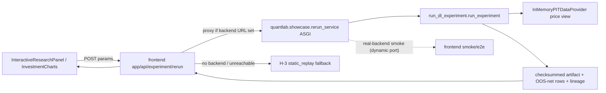

# Design — H Live Backend Rerun API (slice H-4)

> SDD Phase 2. Requirements: [requirements.md](./requirements.md).
> Contract: [contract/live-rerun.schema.json](./contract/live-rerun.schema.json).
> Upstream baseline: [h-interactive-research-ui design](../h-interactive-research-ui/design.md)
> (H-3 static replay), `scripts/run_dl_experiment.py::run_experiment` (H-1/H-2 pipeline).

## 1. Overview

Slice H-4 adds a **live backend rerun** path to the H-3 interactive research UI. H-3 is
*static replay only*: the UI selects a committed deterministic artifact and fails closed
when the chosen parameters have no matching checksum. H-4 keeps that contract intact as the
**fallback** and adds, additively, a real compute path: a governed local Python backend
recomputes the Epic H experiment from user-selected parameters through the **existing**
`run_experiment` pipeline and returns a checksummed artifact + OOS-net rows + lineage.

The load-bearing design decisions (flagged in requirements):

1. **Real-backend smoke (FMEA-H4-01).** Live evidence comes from starting the *real* Python
   backend on a governed dynamic port; a stubbed/mocked backend must fail closed and can
   never produce a green "live" result.
2. **Public provider accessor (REQ-H4-007).** A new public PIT read API replaces every
   `provider._prices` reach-in, killing `ISSUE-DDD-PROVIDER-PRIVATE-001`.

No TypeScript reimplementation of the experiment: the frontend only orchestrates
(validate → call backend → render lifecycle); all computation stays in `run_experiment`.

Domain language (extends H-3):

- **LiveRerunRequest**: validated `ResearchParameters` + a vintage/data-scope handle.
- **LiveRerunResult**: `status` + (on `computed`) the same `InteractiveResearchPayload`
  artifact block H-3 renders, plus `lifecycle` and `computeSource="live_backend"`.
- **RerunLifecycle**: `idle | computing | computed | fail_closed | error` — the explicit
  state machine that forbids spinner-forever and stale-"computed".
- **ProviderPriceView**: the new public read surface (`symbols()`, `price_panel(...)`,
  `event_dates(...)`) the rerun + research/scripts consume instead of `_prices`.

## 2. Architecture



- **Python backend** `quantlab/showcase/rerun_service.py`: a thin ASGI app (uvicorn is
  already a root dep) exposing `POST /api/experiment/rerun`. It validates parameters against
  the shared range contract, calls `run_experiment` into a **temp workspace** (no repo
  pollution; mirrors `test_demo_script_tempstores`), and returns the normalized artifact +
  lifecycle. Framework-isolation holds: orchestration only, **no torch/tf/jax import** (the
  optional torch backend is reached lazily inside `NumpyMLPForecaster`, unchanged).
- **Next.js route** `frontend/app/api/experiment/rerun/route.ts` (POST): proxies to the
  backend URL from `QUANTLAB_RERUN_BACKEND_URL`. When the env is unset (the public static
  export) or the backend is unreachable/times out, it returns the H-3 `static_replay`
  fallback / `error` lifecycle — never a fabricated "computed".
- **Frontend lib** `frontend/lib/live-rerun.ts`: a pure lifecycle reducer
  (`idle→computing→{computed|fail_closed|error}`) + a `requestLiveRerun(params, signal)`
  client with a bounded `AbortController` timeout. Parameter validation reuses the existing
  `validateInteractiveResearchParameters`.
- **Contract** `frontend/lib/showcase-contract.ts`: widen `InteractiveResearchPayload.mode`
  to `"static_replay" | "live_compute"` and add an optional `lifecycle`/`computeSource`
  block; all H-3 honesty literals (`no_alpha_claim`, `out_of_sample_net_only`, visible
  baseline, approximate warning) are enforced on **both** modes by the same validator.
- **Provider public view** `quantlab/data/provider.py`: add `symbols()`,
  `event_dates(symbols)`, and `price_panel(symbols, *, usable_only=True)` returning a
  copy-safe `(symbol, event_date, close)` frame of **finite, positive** rows (same boundary
  as `VectorizedEngine._close` / `_asset_spans`). Refactor `real_data_oos._asset_spans`,
  `multi_cycle_oos`, and `run_dl_experiment._cotemporal_dates` onto it. The accessor is a
  data-extent/universe-selection surface (legitimately not as-of-bounded); the as-of PIT
  gates (`get`/`history`) are unchanged and still the only fetch path during compute.

## 3. Contract (SSOT in `contract/live-rerun.schema.json`)

Request:

```json
{ "parameters": { "backend": "reference", "hiddenUnits": 8, "lookback": 6,
                  "epochs": 40, "seed": 0, "rebalance": "monthly",
                  "symbols": ["^GSPC", "^IXIC"] } }
```

Response (`computed`) reuses the H-3 `InteractiveResearchPayload` block with
`mode="live_compute"`, `computeSource="live_backend"`, `lifecycle="computed"`, and the
`artifact.reportChecksum` / `experimentId` produced by `run_experiment`. Non-computed
responses carry `status` ∈ {`fail_closed`,`error`}, a human `message`, **no rows**, and
`lifecycle` matching the status. Determinism: identical request → byte-identical response;
the committed parameter set's `reportChecksum` equals the H-3 static-replay artifact.

## 4. DDD boundary

- **Interactive Research** bounded context (H-3) owns parameter/replay semantics; H-4 adds
  the *live compute* aggregate without changing H-1/H-2 report schema, A0 engine/data
  contracts, or E registry semantics.
- **Anti-corruption:** the Next.js route is an adapter to the Python backend; the frontend
  never owns experiment math. The provider public view is the only sanctioned cross-context
  read of price extents (closes `ISSUE-DDD-PROVIDER-PRIVATE-001`).

## 5. REFACTOR (with test safety-net)

1. Land the public provider view + migrate `_asset_spans` / `_cotemporal_dates` /
   `multi_cycle` callers under the green CR-A0-CHAOS-001 + real_data_oos suites (already
   exercise the NaN/usable-close boundary), then add the AC-H4-05 grep guard.
2. Extract the H-3 selection/lifecycle messaging shared by static + live paths into
   `live-rerun.ts` before adding the network client, so both modes share one validator.

## 6. Test Coverage Declaration

- **Unit:** TS lifecycle reducer (all transitions incl. timeout→`error`), `requestLiveRerun`
  abort/timeout, contract validation for `mode="live_compute"`; Python rerun-service request
  validation + artifact normalization; provider public-view unit tests (usable-row filter,
  copy-safety, symbol set).
- **Property-Based:** valid parameter grids compute; invalid integers/steps/unknown
  backend/rebalance fail closed on the live path identically to static; live rows stay
  OOS-net sorted with baseline visible; provider `price_panel` never returns non-finite /
  non-positive closes (mirrors `_asset_spans`).
- **Integration:** the rerun service returns a `computed` payload accepted by the Next.js
  route and the showcase contract; the committed parameter set's live checksum **equals**
  the H-3 static artifact (REQ-H4-002 parity); `insufficient_data` from `run_experiment`
  maps to `fail_closed` with no rows.
- **Smoke / E2E (load-bearing, AC-H4-02):** `npm run e2e:rerun` (new) starts the **real**
  Python backend on a governed dynamic port (reuse `selectSmokePort` / `findAvailablePort`),
  drives the UI through `idle→computing→computed`, and asserts a *freshly computed*
  checksum that differs from the committed fixture for a perturbed seed. A **negative** test
  points the route at a stub backend and asserts `fail_closed`/`error` — a stub can never go
  green. Any `page.route`/fixture mock on the live path is labeled and cannot satisfy
  AC-H4-02.1.
- **Async/lifecycle (AC-H4-03):** a deliberately slow/dead backend (beyond timeout) drives
  the UI to a visible `error` state, never an infinite spinner or stale `computed`.
- **Component (AC-H4-04):** new co-located tests for `InteractiveResearchPanel` and
  `InvestmentCharts` rendering `idle/computing/computed/fail_closed/error`, closing the
  current zero-component-test gap; frontend coverage stays ≥ existing thresholds.
- **VRT:** browser baseline for the `computing` and `error` states added to the existing
  interactive VRT; computed-state baseline reused.
- **Mutation:** Python — register a live-rerun validation/fail-closed guard and a provider
  usable-close-filter guard in `run_mutation_spot_checks.py`. Frontend — add mutations for
  the lifecycle `error`/timeout gate and the `live_compute` claim-boundary/baseline gate.
- **Encapsulation (AC-H4-05):** a repo grep guard asserts no `quantlab`/`scripts` file reads
  `provider._prices`.

## 7. Failure Mode and Effects Analysis

| Risk ID | Failure Mode | Effect | Cause | Current Control | Sev | Occ | Det | Planned Response | Task Trace |
|---|---|---|---|---|---:|---:|---:|---|---|
| FMEA-H4-01 | e2e passes against a stubbed/mock backend | **false-green** "live demo works" (Global Constraint #11) | mock used on the live path | mandatory real-backend dynamic-port smoke + negative stub test | 9 | 3 | 2 | Prevent/Detect: AC-H4-02 real smoke asserts fresh checksum; stub path must fail closed | H4-SMOKE |
| FMEA-H4-02 | Slow/dead backend → infinite spinner or stale panel | user sees fake "computed" | no timeout / no lifecycle | bounded `AbortController` + explicit state machine | 8 | 3 | 2 | Prevent: REQ-H4-004 lifecycle, timeout→`error` | H4-LIFECYCLE |
| FMEA-H4-03 | Live path bypasses OOS-net/baseline/no_alpha_claim | overclaim / alpha implication | duplicate validation for live | one shared contract validator on both modes | 9 | 2 | 2 | Prevent: REQ-H4-006 shared guards + mutation | H4-CONTRACT |
| FMEA-H4-04 | Scope creep into current-asof recommendation | crosses locked no-alpha charter (Lane 2) | new "buy now" surface | REQ-H4-008 guard + grep/test for actionable wording | 9 | 2 | 2 | Contain: charter-gated deferral, negative test | H4-CHARTER |
| FMEA-H4-05 | Non-deterministic recompute | checksum drift, public parity breaks | temp-path/seed/ordering leak into checksum | deterministic `run_experiment` + parity-with-static test | 8 | 3 | 2 | Detect: AC-H4-01 determinism + static parity | H4-PARITY |
| FMEA-H4-06 | Provider public view leaks lookahead | PIT violation on rerun | accessor used as a fetch path | view is universe/extent only; compute still fetches via `get`/`history` (`available_date<=asof`) | 9 | 2 | 3 | Prevent: FMEA-H4-06 test asserts compute path unchanged; accessor not used for as-of fetch | H4-PROVIDER |
| FMEA-H4-07 | Public static export appears live | false live/production claim | fallback not shown | route returns `static_replay` + honest "no live backend" when env unset | 8 | 3 | 2 | Prevent: REQ-H4-005 fallback + smoke assertion | H4-FALLBACK |

## 8. Error Handling

Invalid parameters → `fail_closed` (no rows), reusing the H-3 validation messages. Backend
unreachable/timeout → `error` lifecycle with a visible message (never a spinner). Backend
`insufficient_data` → `fail_closed` with the upstream reason. Missing `QUANTLAB_RERUN_BACKEND_URL`
→ `static_replay` fallback. Public hosting stays `not_proven` by the static-artifact
contract; the live API is **not** publicly deployed in this slice.

## 9. Repo-side Closure vs External Execution

Repo-side: requirements/design/tasks, contract schema, the Python backend + Next.js route,
provider public view + migration, all test tiers incl. the real-backend dynamic-port smoke,
component tests, VRT, mutation, governance registries, and review. External: GitHub Pages
stays a static export of the last computed artifact; the live API is not hosted publicly and
public parity remains the deploy-coupled F-owned step.

## 10. EDD

- `uv run pytest -q tests/quantlab/test_h4_live_rerun.py`
- `uv run pytest -q tests/quantlab/test_governance_guards.py`
- `uv run pytest -q` · `uv run mypy quantlab/ --ignore-missing-imports` · `uv run lint-imports`
- `uv run python scripts/run_mutation_spot_checks.py --only <h4 guards>`
- `cd frontend && npm test -- --run` · `npm run coverage`
- `cd frontend && npm run e2e:rerun` (real backend) · `npm run e2e:interactive`
- `cd frontend && npm run visual:browser` · `npm run build && npm run smoke` · `npm run mutation`

## 11. Traceability References

- `REQ-H4-001/002/003` → `quantlab/showcase/rerun_service.py`, `run_experiment`, `frontend/app/api/experiment/rerun/route.ts`
- `REQ-H4-004` → `frontend/lib/live-rerun.ts` (lifecycle reducer + bounded client)
- `REQ-H4-005` → route fallback to H-3 `static_replay`
- `REQ-H4-006` → `frontend/lib/showcase-contract.ts` shared validator
- `REQ-H4-007` → `quantlab/data/provider.py` public view; `real_data_oos`/`multi_cycle_oos`/`run_dl_experiment` migration (`ISSUE-DDD-PROVIDER-PRIVATE-001`)
- `REQ-H4-008` → charter guard test (no actionable-signal wording/endpoint)
- `AC-H4-02` → `frontend/scripts/rerun-e2e.mjs` real-backend smoke + negative stub test
- `AC-H4-04` → co-located `InteractiveResearchPanel`/`InvestmentCharts` component tests
